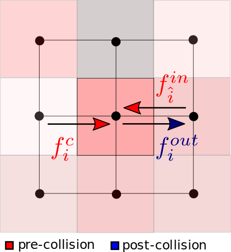
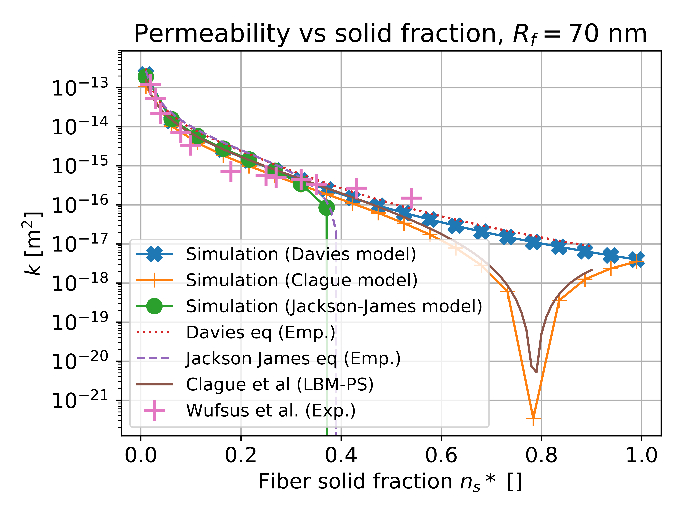

# Hands-on: Partial Bounce-Back method

<script type="text/x-mathjax-config">
  MathJax.Hub.Config({
    tex2jax: {
      inlineMath: [ ['$','$'], ["\\(","\\)"] ],
      processEscapes: true
    }
  });
</script>

## The Partially Saturated Method

This exercise guides you through an example of implementation of the *Partially Saturated Method* or *Partial Bounce-Back* (PBB). In brief, this method consists of simulating voxels that block part of the incoming *populations*. This blocking fraction is commonly called the *solid fraction*.
The method implemented is the one given by Walsh et al. ([https://doi.org/10.1016/j.cageo.2008.05.004](https://doi.org/10.1016/j.cageo.2008.05.004)), and which can be summarized in the following way: 

\begin{equation}
f_i^{out}(x,t) = (1-\gamma)f_i^c(x,t) + \gamma f_{\hat{i}}^{in}(x,t)
\end{equation}

```math
f_i^{out}(x,t) = (1-\gamma)f_i^c(x,t) + \gamma f_{\hat{i}}^{in}(x,t)
```
with $f_i^{out}(x,t)$ the outgoing populations after the PBB step, in lattice direction $i$, at position $x$ and time $t$, $f_i^c(x,t)$ the populations immediately after the fluid collision step, and $f_{\hat{i}}^{in}(x,t)$ the incoming fluid packet before the collision step, in direction $-i$. $\gamma$ is the model solid fraction, which varies from **0** (completely **fluid** node) to **1** (completely **solid** node). 
<center>
<br/>

<br/>
</center>

Walsh et al. show that, with this method, $\gamma$ is related to the permeability $k$ of the PBB voxel as follows:
\begin{equation} \label{eq-k_ns}
k = \frac{(1-\gamma)\nu\,dt}{2\gamma}
\end{equation}
where $\nu$ is the viscosity of the fluid and $dt$ the time interval of the LB simulation. $k$ and $\nu$ are here in physical units.
By inverting this relationship, we have an explicit expression for the model solid fraction to impose, in terms of the desired permeability for our porous medium:
\begin{equation}
\gamma = \frac{1}{1+\frac{2k}{\nu\,dt}}.
\end{equation}

## Compilation and execution

Open the current folder, namely:

	palabos/examples/showCases/partialBounceBack
	
in a terminal. Then, compile using simply:

	make
To run the code, you will then have to type:
	
	./fibrinolysis

for a single-processor execution, or:

	mpirun -n NCores ./fibrinolysis

for a parallel execution, where *NCores* is the number of available CPU cores you wish to allocate.

## Exercise
### Run the code
Try first to compile and run the code as is. Several output files will be generated in the *tmp* folder.

- **clotStat.dat**: a text file which contains the evolution of clot composition in time;
- **flow.dat**: a text file which contains flow data (pressure gradient across clot, seepage velocity, permeability...);
- **vtk files** to be opened with **[ParaView](https://www.paraview.org/)** in the vtk folder:
	- **particles\*.vtk**: the anti-fibrin particles. Apply a *Glyph 3D* > *Sphere* filter to visualize them;
	- **voldata\*.vti**: flow data. You can for instance use a *Slice* filter along the tube (X or Y normal), and visualize pressure or velocity. You could also use the *Streamtracer* filter (Point Source, increase radius and # of points);
	- **voldataClot\*.vti**: clot fibrin quantity per voxel. You can use either a *Slice* along the tube, or the *Threshold* filter. In the latter case, put a minimal value of about 10% of the maximum value.
	- **voldataSF\*.vti**: clot solid fraction data. It is basically the same data as voldataClot, up to a conversion factor. Equals 1-porosity at voxel level.

### Change the permeability model
As seen in the lecture, a permeability model represents the dependency of the permeability $k$ on the solid fraction  $n_s^\*$ of the porous medium. This relation depends on the nature of the porous medium. 
Based on measurements by Wufsus et al. ([https://doi.org/10.1016/j.bpj.2013.02.055](https://doi.org/10.1016/j.bpj.2013.02.055)), Davies model seems to represent quite well the permeability law of *in-vitro* fibrin clots. However, other permeability models for porous media can be used, for media that are not fibrin clots.
The figure below shows the comparison of the other models' implementation with their analytical expression, and with Wufsus' measurements for fibrin clots (the fiber radius taken here is 70 nm).

<center>
<br/>

<br/>
</center>

Change the permeability model by changing the *permeModel* variable in **simParams.h**, with *Clague* or *JJ*. Assess how the fibrinolysis is affected.

### Change the clot file
The model from which this exercise was built, was designed to have the possibility for heterogeneous clots. The clot geometry and composition is specified in the file *clot_0.0003.txt*. Each block of numbers represent a slice along the longitudinal (Z-)axis of the clot. A number represents the clot solid fraction in the voxel of the corresponding position. In the file provided, the solid fraction is 0.0003 everywhere, creating a homogeneous fibrin clot. This value is quite low, this is so that you can simulate a lysis on a laptop in approximately 15 min of computation time.
By increasing the solid fraction at a given position, one can mimic for instance the presence of platelets in that region.
Try modifying manually the solid fraction (between 0: fluid; and 1: solid) of regions of your choice, and see how the fibrinolysis is affected.
